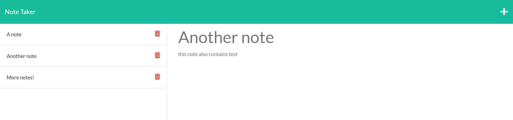

# note-taker

## Description
  An application that users can write and save notes with. Delete functionality will be added in the future.

 ## Table of Contents

  - [Installation](#installation)
  - [Usage](#usage)
  - [Screenshot](#Screenshot)
  

  ## Installation
  Use git clone in git bash after copying the link at https://github.com/jreese8/note-taker.

  
  ## Usage
  This application can be used to jot down notes. Type "npm start" in the terminal to start the program.

  ## Screenshot
  